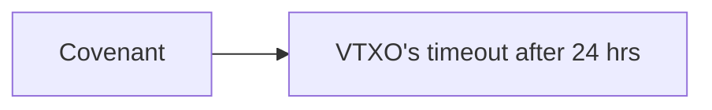

### Overview

Alice wants to board the Ark of a well-known Ark service provider (ASP). It requires an on-chain transaction.

Depending on the type of [Boarding transaction](/docs/learn/nomenclature#boarding-transaction) chosen by the ASP, the timeline is different.

### 🧳 Boarding

- Alice must be online **at least once every 4 weeks** to keep her funds safe
- If ASP is unresponsive, Alice can claim her funds back in **24 hours**
- Easier for the ASP since all VTXOs are born equal
- To unlock the boarding address Alice needs to make two transactions:

#### Timeline of events

1. Alice creates a [Boarding transaction](/docs/learn/nomenclature#boarding-transaction)
2. Alice adds any inputs she wants to cover the values the [VTXO](/docs/learn/nomenclature#vtxo-1) she will receive, plus on-chain fees
3. Alice adds an output with **2 spending paths**:
   - This funds will belong to the ASP after 4 weeks:
     - `(ASP after 4w)`
   - A covenant output that forces coins to be spent to create a [VTXO](/docs/learn/nomenclature#vtxo-1) output script with **2** spending paths:
     - `(Alice + ASP)`
     - `(Alice after 24h)`
4. Alice notifies ASP about the [Boarding transaction](/docs/learn/nomenclature#boarding-transaction)
5. Alice has now a promise of a [VTXO](/docs/learn/nomenclature#vtxo-1) enforced by a covenant.
